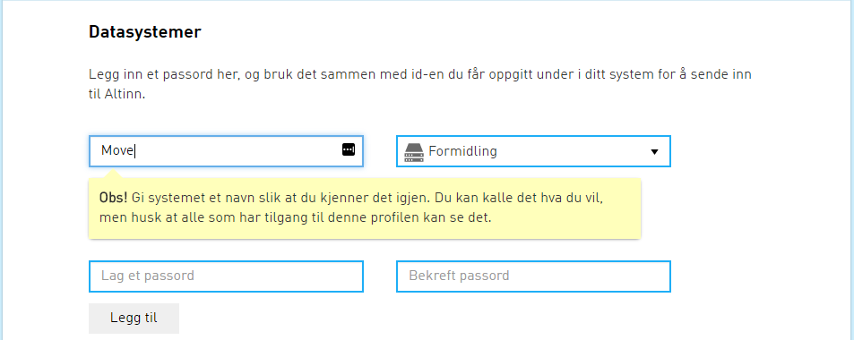

*Under arbeid, endringer vil forekommer i nærmeste fremtid*
[testlink][../resources/integrasjonspunkt-local.properties]
eInnsyn er en prosess der statelige virksomheter gjør metadata for korrespondanse tilgjengelig for offentligheten. Integrasjonspunktet fungerer som et bindeledd mellom eInnsynsklienten brukt av arkivarene og det sentrale eInnsynsystemet.

For å sette opp integrasjonspunktet til å støtte eInnsyn, må du gjøre følgende: 


## Dette gjør du før installasjon av Integrasjonspunktet

+ 3x tilgjengelig minne i forhold til største meldinger ønsket sendt
+ Nødvendige brannmursåpninger
+ Java 8 med JCE installert
+ Test virksomhetssertifikat utstedt av Buypass eller Commfides. [Les mer] ()
+ BestEdu ekspederingskanal skrudd på i sak-/arkivsystem
+ Tips: Installer integrasjonspunktet og eInnsynsklient på samme server.

### 1. Brannmuråpninger for eInnsyn

Sentrale tjenester(Adresseoppslag, senteral konfigurasjon mm.)
+ beta-meldingsutveksling.difi.no -> 93.94.10.30:443, 93.94.10.45:443, 93.94.10.5:443

Id-portens autentiseringstjeneste
+ oidc-ver2.difi.no -> 146.192.252.152:443

Meldingsformidler eInnsyn
+ move-dpe.servicebus.windows.net -> *.cloudapp.net

### 2. Installere Java runtime environment (JRE)

Integrasjonspunktet er en Java applikasjon og krever derfor at man har Java kjøremiljø installert på serveren den skal kjøre.
For å verifisere om java er installert og hvilken versjon kan du i et kommandolinje vindu bruke kommandoen

```
java -version
```

Meldingsformidlingsapplikasjonen krever minimum versjon 1.8.0

Dersom Java ikke er installert eller versjonen er for gammel, kan ny versjon lastes ned [her](http://www.oracle.com/technetwork/java/javase/downloads/jdk8-downloads-2133151.html) og installeres.

### 3. Installere Java Cryptography Extension (JCE)

Bruker du ny versjon av Java, må ny JCE installeres. Last ned JCE fra [Oracles sider](http://www.oracle.com/technetwork/java/javase/downloads/jce8-download-2133166.html).

Det er ikke noen enkel måte å sjekke om Java Cryptography Extension er installert. Ofte kan det enkleste være å bare laste ned og installere JCE, men om du ønsker å sjekke, kan du gå til mappen ```$JAVA_HOME/jre/lib/security``` og sjekke om filene ```US_export_policy.jar``` og ```local_policy.jar``` har nyere dato enn øvrige filer. Hvis datoen er lik, må du installere JCE.
Dersom JCE mangler vil integrasjonspunket stoppe under oppstart og skrive logmelding om manglende JCE.

### 4. Virksomhetssertifikat

NB! Testmiljø krever **test virksomhetssertifikat**. Produksjonsertifikat vil ikke virke i test

NB2! Bruk sertifikatet merkt som **Autentiseringssertifikatet**

**Å gjøre:**
1. Anskaffe test virksomhetssertifikat
2. Legge sertifikat i Java Key Store.
3. Sende sertifikat til Difi.

**Hvordan?**

[VEILEDNING: Les alt om håndtering av virksomhetssertifikat her](http://difi.github.io/move-integrasjonspunkt/vStaging/#/4_sertifikat)

Integrasjonspunktet bruker virksomhetssertifikat til kryptering og signering av meldinger som går mellom integrasjonpunkter.
Virksomhetssertifikat som kan benyttes leveres av [Commfides](https://www.commfides.com/e-ID/Bestill-Commfides-Virksomhetssertifikat.html) og [Buypass](http://www.buypass.no/bedrift/produkter-og-tjenester/buypass-virksomhetssertifikat)


## Installasjon av Integrasjonspunktet *(under arbeid)*

1. Last ned properties filen relevant til ditt sak-arkivsystem: 
2. Fyll inn følgande felt


### Oppsett

Start med å opprette en mappe med navn integrasjonspunkt på c:\

Last deretter ned integrasjonspunktet fra artifactory (se link i top av dokument) og legg den i overnevnte mappe
Opprett filen integrasjonspunkt-local.properties på området

### integrasjonspunkt-local.properties

Følgende verdier settes i integrasjonspunkt-local.properties

NB: Benytt skråstrek (/) eller dobbel omvendt skråstrek (\\\\) som resursdeler når dere angir filbaner.

#### For alle installasjoner

**Propertie**                          |**Beskrivelse**                                                                                               |**Eksempel**
---------------------------------------|--------------------------------------------------------------------------------------------------------------|-----------------
server.port                            |Portnummer integrasjonspunktet skal kjøre på (default 9093)                                                   |9093
                                       |                                                                                                              |
difi.move.org.number                   |Organisasjonsnummer til din organisasjon (9 siffer)                                                           |123456789
difi.move.org.keystore.path            |Path til .jks fil                                                                                             |c:/integrasjonspunkt/keystore.jks
difi.move.org.keystore.password        |Passord til keystore                                                                                          |changeit
difi.move.org.keystore.alias           |Alias til virksomhetssertifikatet som brukes i integrasjonspunktet                                            |alias
difi.move.nextbest.serviceBus.enable   |Skru på bruk av eInnsynsmeldinger                                                                             |true
difi.move.nextbest.serviceBus.sasToken |Token som må brukes for tilang til meldingsformidler                                                          |*Se infobrev om einnsyn*


#### DPV spesifikke

**Propertie**                          |**Beskrivelse**                                                                                               |**Eksempel**
---------------------------------------|--------------------------------------------------------------------------------------------------------------|-----------------
difi.move.feature.enableDPV=true       |Skrur på muligheten til å sende meldinger til private virksomhter via AltInn                                  |true
difi.move.dpv.username           |Brukernavn for AltInn tjenesteeier                                                                            |
difi.move.dpv.password           |Passord for overnevnte bruker                                                                                 |


#### DPI spesifikke

**Propertie**                          |**Beskrivelse**                                                                                               |**Eksempel**
---------------------------------------|--------------------------------------------------------------------------------------------------------------|-----------------
difi.move.feature.enableDPI=true       |Skrur på muligheten til å sende meldinger til innbygger                                                       |true


#### DPO spesifikke

**Propertie**                          |**Beskrivelse**                                                                                               |**Eksempel**
---------------------------------------|--------------------------------------------------------------------------------------------------------------|-----------------
difi.move.feature.enableDPO=true       |Skrur på muligheten til å sende og motta DPO meldinger vi integrasjonspunktet                                 |true
difi.move.noarkSystem.endpointURL      |URL integrasjonspunktet finner sak-/arkivsystemets BestEdu tjenester                                          |Se eksempelfil for eksempel
difi.move.noarkSystem.type             |Sak/-arkivsystem type                                                                                         |ephorte/P360/WebSak/mail
difi.move.noarkSystem.username\*       |Brukernavn for autentisering mot sak-/arkivsystem                                                             |svc_sakark
difi.move.noarkSystem.password\*       |Passord for autentisering mot sak-/arkivsystem                                                                |changeit
difi.move.noarkSystem.domain\*         |Domene sakarkivsystemet kjører på                                                                             |
                                       |                                                                                                              |
difi.move.msh.endpointURL\*\*          |Path til MSH                                                                                                  |
                                       |                                                                                                              |
difi.move.dpo.username              |Brukernavnet du får ved [opprettelse av AltInn systembruker](#opprette-bruker-til-altinn-formidlingstjeneste) |123456
difi.move.dpo.password              |Passord du satte når du opprettet AltInn systembruker                                                         |changeit


\* Autentisering mot sakarkivsystem benyttes av P360

\*\* Denne brukes bare dersom du allerede har BestEdu og ønsker å sende filer via gammel MSH til deltakere som ikke er en del av piloten. Integrasjonspunktet vil da opptre som en proxy.

Last ned eksempel for [ephorte](../resources/integrasjonspunkt-local.properties_ephorte), [P360](../resources/integrasjonspunkt-local.properties_360), [WebSak](../resources/integrasjonspunkt-local.properties_websak)
Lagre filen på området c:\integrasjonspunkt og endre navnet til integrasjonspunkt-local.properties


Når du er ferdig skal strukturen på området se slik ut:

```
c:/
|-- integrasjonspunkt/
   |-- integrasjonspunkt-local.properties
```

### Opprette bruker til AltInn formidlingstjeneste

> Gjelder DPO (Digital post mellom offentlige virksomheter)

Integrasjonspunktet kjører som [datasystem](https://www.altinn.no/no/Portalhjelp/Datasystemer/) mot AltInn's meldingsformidler. Integrasjonspunktet må registeres som et datasystem AltInn's portal. Informasjon om hvordan dette gjøres finnes [her](https://www.altinn.no/no/Portalhjelp/Datasystemer/Registrere-datasystem/).

Når du oppretter datasystemet er det viktig at det gjøres av person som kan representere virksomheten. Hvordan man repreenterer virksomehen kan du lese [her](https://www.altinn.no/no/Portalhjelp/Hvordan-representere-andre/).

Under opprettelse av datasystem velger du passord og får tildelt brukerid (ID), disse skal senere brukes i properties filen som beskrives lenger nede.

Eksempel:

Registrere datasystem



Datasystem registrert


Informasjon om hvordan du logger på AltInn portal finner du [her](https://www.altinn.no/no/Portalhjelp/Innlogging/).


### Konfigurere sak-/arkivsystem til å bruke Integrasjonspunktet

> Gjelder DPO

Oppsett for ephorte, [P360](../resources/Oppsett360.docx), WebSak

### Brannmursåpninger

Sentrale tjenester(Adresseoppslag, senteral konfigurasjon mm.)
+ beta-meldingsutveksling.difi.no -> 93.94.10.30:443, 93.94.10.45:443, 93.94.10.5:443

Id-portens autentiseringstjeneste
+ oidc-ver2.difi.no -> 146.192.252.152:443

Meldingsformidler eInnsyn
+ move-dpe.servicebus.windows.net -> *.cloudapp.net

Logging
+ 93.94.10.18:8300

Meldingsformidler DPO og DVP
+ www.altinn.no -> 79.171.86.33:443

Meldingsformidler DPI
+ qaoffentlig.meldingsformidler.digipost.no -> 146.192.168.18:443, 146.192.168.19:443

Meldingsformidler KS SvarUt/SvarInn
+ test.svarut.ks.no -> 193.161.160.165:443

### Start Integrasjonspunktet

Integrasjonspunktet startes fra kommandolinjen med kommandoen (Kjør som administrator)

```powershell
java -jar -Dspring.profiles.active=staging integrasjonspunkt-[versjon].jar --app.logger.enableSSL=false 
```


kommandoen

```
http://localhost:<port-til-integrasjonspunkt>/noarkExchange?wsdl
```

gir response i form av en wsdl når Integrasjonspunktet har startet.


Spørsmål rundt integrasjonspunktet installasjon eller forslag til forbedringer av installasjonsbeskrivelsen kan sendes til vår [supportmail](mailto:idporten@difi.no)


